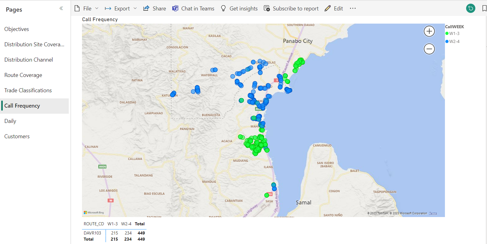
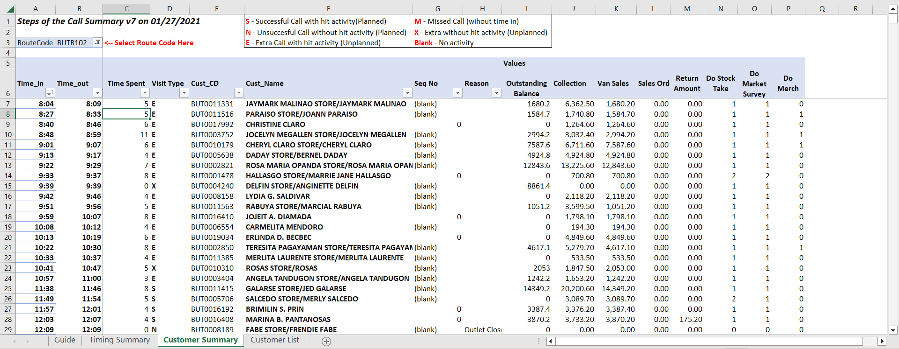
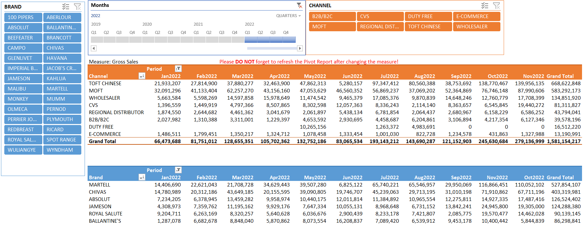
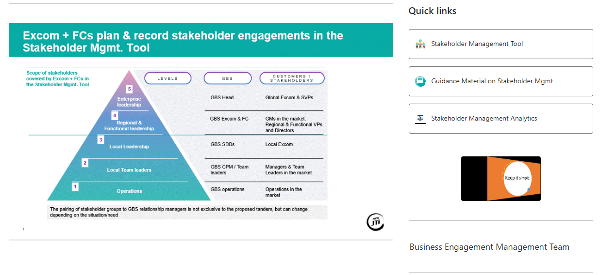

# Profile 
A ServiceNow Certified Systems Administrator and forward-thinking Business Analyst professional, with extensive experience in end-to-end product delivery, project management, 
and fostering client engagement. Adept at collaborating with cross-functional teams to understand business needs and delivering innovative solutions. 
With a proven track record as a seasoned Data Analyst, I specialize in empowering Marketing and Sales teams through the implementation of Excel and Power BI dashboards 
for data-driven decision-making strategies. 

## Sample Sales Operations Power BI Reports

## Sample KPI Excel Reports

## Sample Sharepoint Site

###### End
