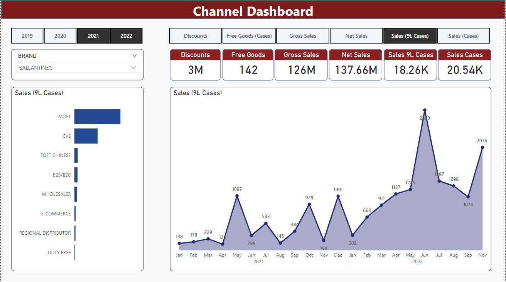
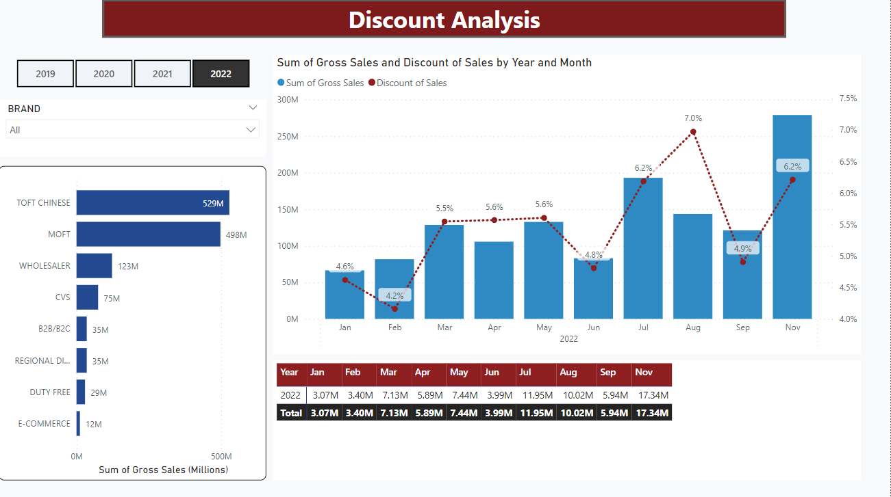
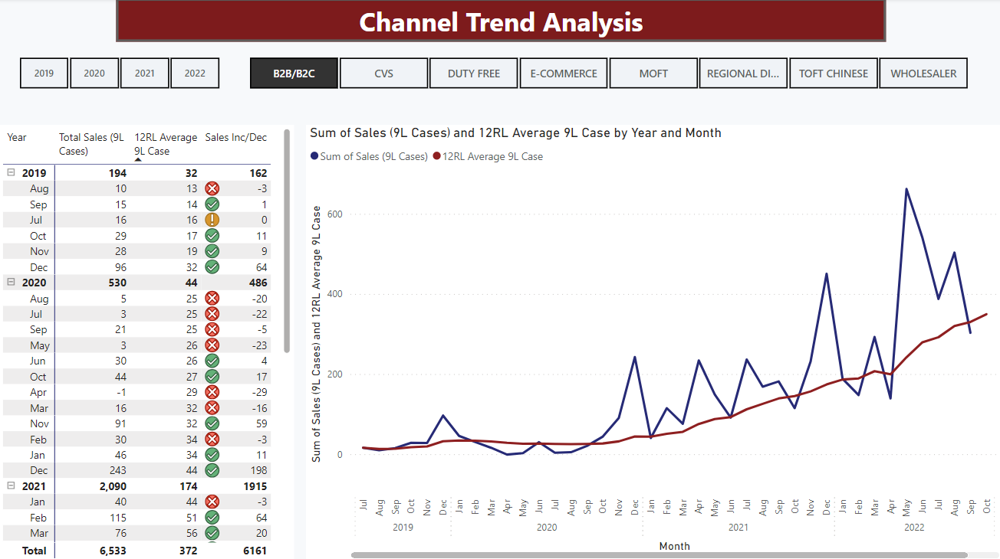
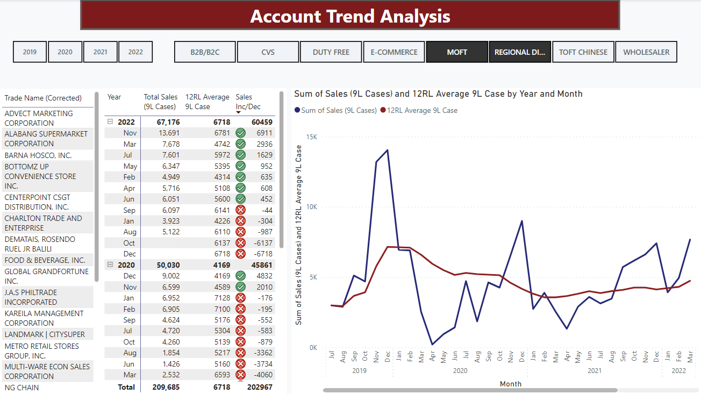

# Profile 
Result-oriented with a deep understanding of end-to-end product delivery from scoping to deployment, project management, client engagement, collaboration skills demonstrated over the course of the project, and the ability to liaise with clients to understand underlying needs and propose unique innovative solutions to address business needs.
Experienced Data Analyst helping the Marketing and Sales team to make data-driven decisions. 

### Work Experience
Process Analyst Manager @ JTI GBS - Poland
- Transition Marketing & Sales Reporting, and New Product Development business processes from JTI Markets to JTI GBS
- Lead support for Marketing & Sales and Cross Functional products Service Management in ServiceNow platform
- Lead support for ServiceNow Project Portfolio Management (PPM)
- Lead the nationwide implementation of JTI Phils. Sales Force Automation
- Develop and implement Excel and Power BI reporting solution (Sales Analysis and Forecasting, Inventory Management, Sales KPI, and Route-to-market)
  
RED Senior Specialist @ Coca-Cola Bottlers Philippines Inc.
- Lead the nationwide implementation of Right Execution Daily (RED) a mobile solution that measures the level of execution of marketing and sales strategies
- Sequel Server Analysis Service (SSAS) OLAP cubes administration
- Develop and implement Distrbutor Partner Factbook management
- Develop and implement Excel reporting solution (Sales Analysis and Forecasting, Inventory Management, Sales KPI, and Route-to-market) 

### Sample Sales Analysis Power BI Reports

### Sample User Acceptance Testing Power BI Reports

### Sample KPI Excel Reports

### Sample Sharepoint Site

###### End
